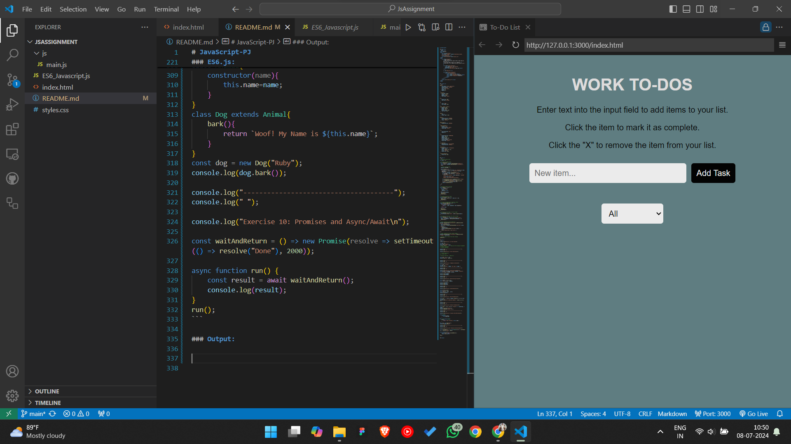
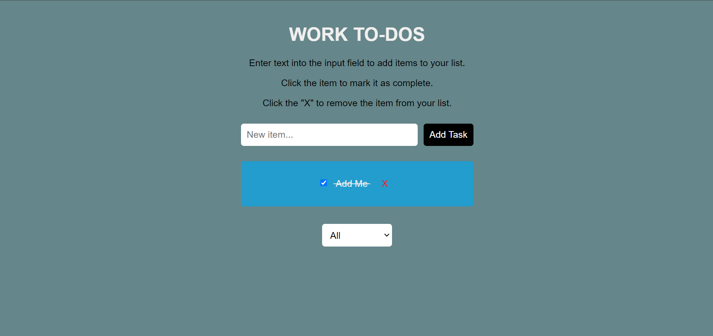

# JavaScript-PJ

### index.html:
```html 
<!DOCTYPE html>
<html lang="en">
<head>
    <meta charset="UTF-8">
    <meta name="viewport" content="width=device-width, initial-scale=1.0">
    <title>To-Do List</title>
    <link rel="stylesheet" href="styles.css">
</head>
<body>
    <div class="container">
        <h1>WORK TO-DOS</h1>
        <p>Enter text into the input field to add items to your list.</p>
        <p>Click the item to mark it as complete.</p>
        <p>Click the "X" to remove the item from your list.</p>
        
        <div class="input-container">
            <input type="text" id="new-task" placeholder="New item...">
            <button id="add-task-btn">Add Task</button>
        </div>

        <ul id="todoList"></ul>

        <div class="filter-container">
            <select id="filterSelect">
                <option value="all">All</option>
                <option value="completed">Completed</option>
                <option value="incomplete">Incomplete</option>
            </select>
        </div>
    </div>
    <script src="js/main.js"></script>
</body>
</html>
```

### styles.css:
```css
body {
    font-family: Arial, sans-serif;
    background-color: #65868a;
    color: #f1efef;
    text-align: center;
    margin: 0;
    padding: 0;
}

.container {
    max-width: 400px;
    margin: 0 auto;
    padding: 20px;
    text-align: center;
}

h1 {
    margin-top: 20px;
    font-size:xx-large;
}

p{
    color: #000;
    font-weight: 300;
}

input, button, select {
    padding: 10px;
    margin: 10px 0;
    border: none;
    border-radius: 5px;
    font-size: 16px;
}

input {
    flex: 1;
    margin-right: 10px;
}

button {
    background-color: #000000;
    color: rgb(255, 255, 255);
    cursor: pointer;
}

button:hover {
    background-color: #004d40;
}

.input-container {
    display: flex;
    justify-content: center;
    align-items: center;
}

ul {
    list-style-type: none;
    padding: 0;
}

li {
    background-color: #2e98c5a0;
    margin: 10px 0;
    padding: 10px;
    border-radius: 5px;
    display:flexbox;
    justify-content:flex-end;
    align-items: center;
}

li.completed {
    text-decoration: line-through;
    background-color: #239dcd;
}

.delete-btn {
    background-color: transparent;
    border: none;
    color: rgb(235, 10, 10);
    cursor: pointer;
    margin-left: 10px;
}

.filter-container {
    margin-top: 20px;
}
```

### main.js : 
```js
// Initialize tasks array
let tasks = [];

// Function to render tasks
const renderTasks = () => {
  const todoList = document.getElementById('todoList');
  const filter = document.getElementById('filterSelect').value;

  // Clear existing list
  todoList.innerHTML = '';

  tasks.forEach((task) => {
    if (filter === 'all' || (filter === 'completed' && task.completed) || (filter === 'incomplete' && !task.completed)) {
      const li = document.createElement('li');
      li.className = task.completed ? 'completed' : '';
      li.innerHTML = `
        <input type="checkbox" ${task.completed ? 'checked' : ''}>
        <span>${task.title}</span>
        <button class="delete-btn">X</button>
      `;
      li.querySelector('input').addEventListener('change', () => toggleTaskCompleted(task.id));
      li.querySelector('.delete-btn').addEventListener('click', () => deleteTask(task.id));
      todoList.appendChild(li);
    }
  });
};

// Function to add a new task
const addTask = (title) => {
  const newTask = {
    id: Date.now(),
    title,
    completed: false
  };
  tasks.push(newTask);
  saveTasks();
  renderTasks();
};

// Function to delete a task
const deleteTask = (id) => {
  tasks = tasks.filter(task => task.id !== id);
  saveTasks();
  renderTasks();
};

// Function to toggle task completion status
const toggleTaskCompleted = (id) => {
  tasks = tasks.map(task => {
    if (task.id === id) {
      return { ...task, completed: !task.completed };
    }
    return task;
  });
  saveTasks();
  renderTasks();
};

// Function to save tasks to local storage
const saveTasks = () => {
  localStorage.setItem('tasks', JSON.stringify(tasks));
};

// Function to load tasks from local storage
const loadTasks = () => {
  const storedTasks = localStorage.getItem('tasks');
  tasks = storedTasks ? JSON.parse(storedTasks) : [];
  renderTasks();
};

// Event listener for form submission
document.getElementById('add-task-btn').addEventListener('click', (event) => {
  event.preventDefault();
  const title = document.getElementById('new-task').value.trim();
  if (title) {
    addTask(title);
    document.getElementById('new-task').value = '';
  } else {
    alert('Please enter a task title.');
  }
});

// Event listener for filter select change
document.getElementById('filterSelect').addEventListener('change', renderTasks);

// Initial load of tasks from local storage
loadTasks();
```

### ES6.js:
```js
console.log("Exercise 1: Let and Const\n")

let age = 30;
const name = "Alice";
console.log("Name: ",name)
// name = "Bob";          {Pops out Error Saying "Assignment to constant variable"}
// console.log(name);  

console.log("--------------------------------------");
console.log(" ");

console.log("Exercise 2: Arrow Functions\n");

// function add(a,b){
//   return a+b;
// }
// console.log("Sum : ",add(2,3));

const add = (a,b) => a+b;
console.log("Sum: ",add(5,3));


console.log("--------------------------------------");
console.log(" ");

console.log("Exercise 3: Template Literals\n");

const Name = "Alice";
let Age = 30;
console.log(`Hello, ${Name}! Your age is ${age}`);

console.log("--------------------------------------");
console.log(" ");

console.log("Exercise 4: Destructuring Objects");
const person = {firstName: "Alice", lastName: "Johnson"}
const{firstName,lastName} = person;

console.log(firstName);
console.log(lastName);

console.log("--------------------------------------");
console.log(" ");

console.log("Exercise 5: Destructuring Arrays\n");

const numbers = [1,2,3,4,5];
const [first,second] = numbers;

console.log(numbers);
console.log(first);
console.log(second);

console.log("--------------------------------------");
console.log(" ");

console.log("Exercise 6: Spread Operator\n");

const arr1=[1,2,3,4];
const arr2=[5,6,7,8];
const comarr=[...arr1,...arr2];
console.log(comarr);

console.log("--------------------------------------");
console.log(" ");

console.log("Exercise 7: Rest Parameters\n");

const sum = (...numbers)=>numbers.reduce((acc,current)=>acc+current,0);
console.log("Sum of indefinite Numbers: ",sum(1,2,3,4,5,6,7));

console.log("--------------------------------------");
console.log(" ");

console.log("Exercise 8: Default Parameters\n");

const greet = (name, greeting = "Hello") => `${greeting}, ${name}!`;
console.log(greet("Andrew"));
console.log(greet("Alexa","Hi"));

console.log("--------------------------------------");
console.log(" ");

console.log("Exercise 9: Classes and Inheritance\n");

class Animal{
    constructor(name){
        this.name=name;
    }
}
class Dog extends Animal{
    bark(){
        return `Woof! My Name is ${this.name}`;
    }
}
const dog = new Dog("Ruby"); 
console.log(dog.bark());

console.log("--------------------------------------");
console.log(" ");

console.log("Exercise 10: Promises and Async/Await\n");

const waitAndReturn = () => new Promise(resolve => setTimeout(() => resolve("Done"), 2000));

async function run() {
    const result = await waitAndReturn();
    console.log(result);
}
run();
```

### Output:



